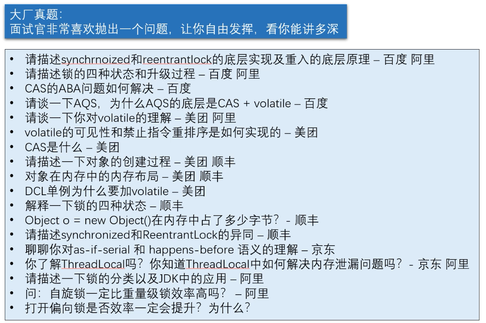
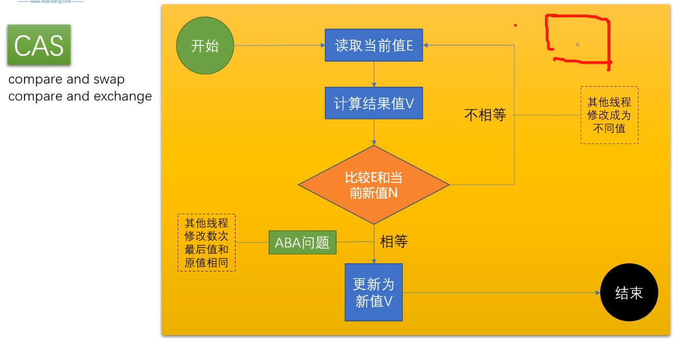
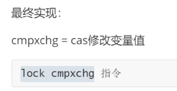
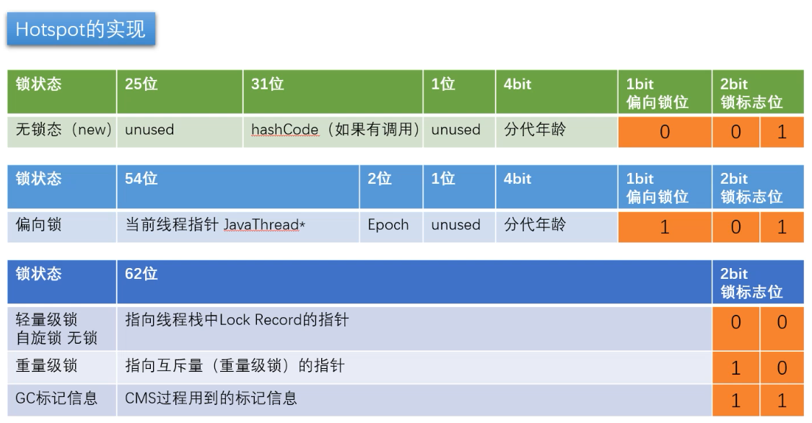
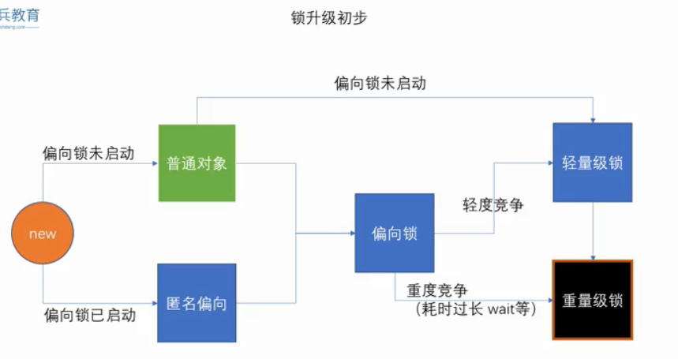

#### CAS

compare and swap

ABA问题：加版本号解决，每次修改递增一个版本号

#### UnSafe

AtomicInteger调用了UnSafe类的compareAndSwap,使用lock cmpxchg保证cmpxchg操作过程中不被打断

#### 用户态和内核态

内核可以操作所有的资源，用户态只能操作部分资源，如果用户程序需要使用内核资源，需要通过内核进行操作，状态由用户态切换到内核态操作；

#### 对象的内存布局

根特定的虚拟机有关，以hotspot为例

markword(8个字节)、类型指针（4个字节）、实例数据、对齐填充

Object占16个字节

偏向锁、轻量级锁不需要向内核申请，由用户空间完成，重量级锁需要向内核申请

偏向锁：对对象的做一个偏向锁标记

轻量级锁：LockRecord,通过自旋的方式竞争锁

重量级锁:向操作系统申请

synchronized：在jvm层级是通过moniterrenter和moniterexit实现

锁重入：synchronized是可重入锁

可重入次数必须记录，因为要解锁几次必须得对应

偏向锁->线程栈->LR+1

重量级锁->ObjectMonitor的字段上

**自旋锁什么时候升级为重量级锁**

**为什么有自旋锁还需要重量级锁**

自旋是消耗cpu资源的，如果锁的时间长，或者自旋线程多，cpu资源会被大量消耗

重量级锁有等待队列，所有拿不到锁的进入等待队列，不需要消耗cpu资源

**偏向锁启动和未启动**

**偏向锁是否一定比自旋锁效率高**

不一定，在明确知道会有多线程竞争的情况下，偏向锁肯定会涉及导锁撤销，这时候直接使用自旋锁

jvm启动过程，会有很多线程竞争（明确），所以默认情况下启动时不打开偏向锁，过一段儿时间再打开

偏向锁调用了wait直接进入重量级锁

作业：普通对象->偏向锁

