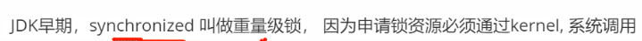

#### CAS

compare and swap

ABA问题：加版本号解决，每次修改递增一个版本号

#### UnSafe

AtomicInteger调用了UnSafe类的compareAndSwap,使用lock cmpxchg保证cmpxchg操作过程中不被打断

#### 用户态和内核态

内核可以操作所有的资源，用户态只能操作部分资源，如果用户程序需要使用内核资源，需要通过内核进行操作，状态由用户态切换到内核态操作；

#### 对象的内存布局

根特定的虚拟机有关，以hotspot为例

markword(8个字节)、类型指针（4个字节）、实例数据、对齐填充

Object占16个字节

偏向锁、轻量级锁不需要向内核申请，由用户空间完成，重量级锁需要向内核申请

