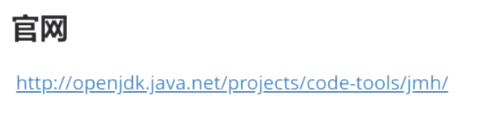
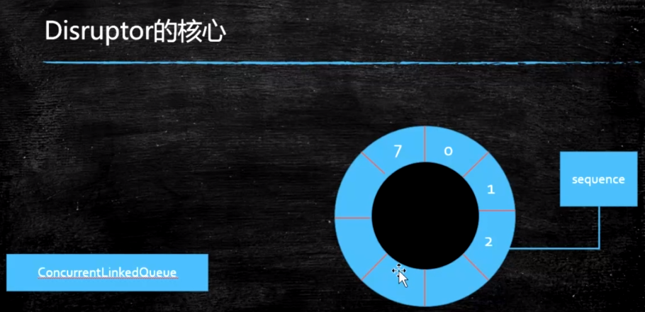
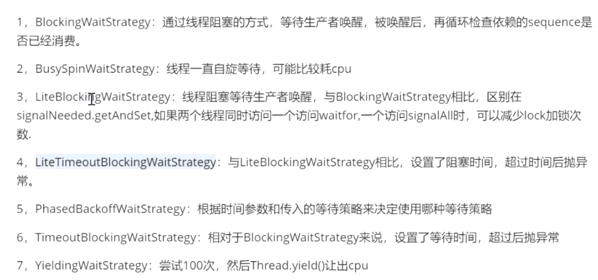

#### JMH:本地代码压测工具

#### Benchmark

warmup:预热，预热多少次，预热多长时间

fork:起多少个线程去运行

BeanchmarkMode: 测试模式，Throughput吞吐量

Measurement:  调用多少次，调用的时间间隔

#### Disruptor

内存中存放数据的高效队列（环形队列）

底层：基于数组实现

对比：ConcurrentLinkedQueue 链表实现

sequence:写指针

EventFactory的作用：

>  这里牵扯到效率问题，disruptor初始化的时候，会调用Event工厂，对ringBufferr进行内存的提前分配

GC产生频率会降低

开发步骤：

> 定义Event
>
> 定义EventFactory
>
> 定义EventHandler

代码：

>  1.简单demo
>
>  2.lmbada表达式的写法
>
>  3.lmbada表达式的写法2
>
>  4.50个线程在单线程模式下生产5000个数据
>
>  5.设置不同的等待策略
>
>  6.设置多个消费者
>
>  7.设置ExceptionHandler处理异常

​	

#### 等待策略

