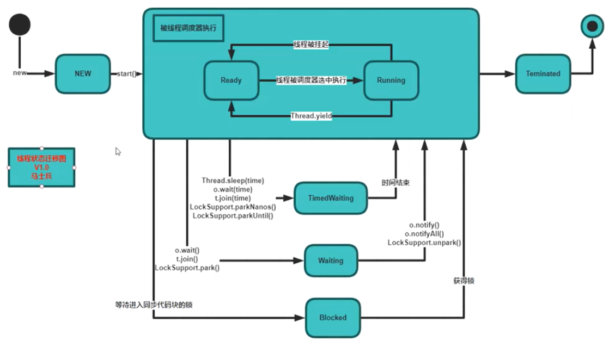

#### 进程、线程、协程、纤程

进程：一个程序被load到内存运行起来，叫做一个进程

线程：进程的最小执行单元，一个程序里不同的执行路径

面试：启动线程的三种方式：：Thread、Runnable、Executors.newCachedThread

sleep：睡眠后进入就绪状态

yield:让出cpu给别的线程执行，该线程进入等待队列等待操作系统调度

join：等待被join的线程执行完然后继续执行，用来等待另一个线程结束

Java线程状态迁移图：

就绪:线程进入等待队列等待cpu调度

blocked：阻塞状态，锁等待

sleep、yeild、join

结束线程：使用Boolean变量让线程正常结束

Java程序启动：是多线程的，因为jvm有一些后台线程

synchronized:既保证原子性，又保证可见性，就不用再加volatile

可重入锁：同一个线程调用多个同步方法，锁定都是同一个对象时，锁是可重入的；

子类对象：有个super指针指向父类对象

synchronized代码块发生异常会自动释放锁,有可能造成别的线程乱入

jdk1.5前，synchronized直接向操作系统申请重量级锁，1.5后，synchronized有一个锁升级的过程；

线程执行时间短或者竞争的线程数比较少，使用自旋锁效率高，否则使用重量级锁效率高

重量级锁：等待的线程被放到等待队列中，不占用cpu资源

