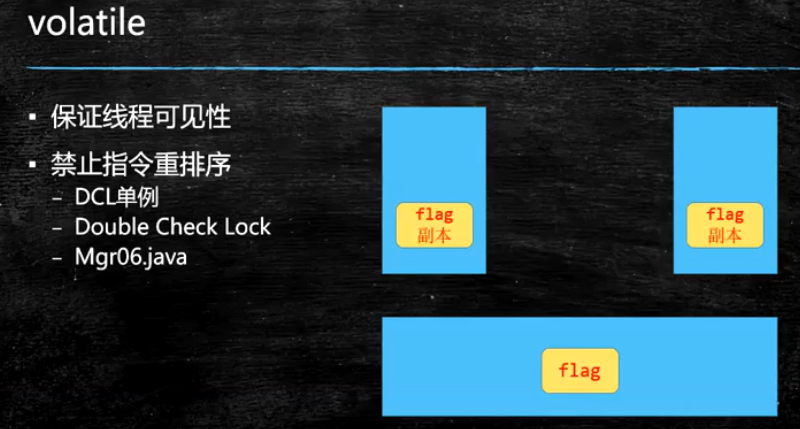

##### 面试：大对象什么情况下直接进入old区？

PretenureSizeThreshold  晋升年老代的对象大小。默认为0，比如设为10M，则超过10M的对象将不在eden区分配，而直接进入年老代。

#### volatile

不能保证原子性，

保证线程可见性 从硬件层面是通过-MESI 缓存一致性协议实现

通过内存屏障禁止指令重排序，loadfence原语指令、storefence原语指令

#### synchronized 优化

锁粗化：StringBuffer在循环中使用

锁细化：同步的语句块越小越好

被锁定的对象最好加final，不允许被重新赋值，否则线程同步会出现问题

#### 代码

测试volatile、dcl双重检查锁、锁细化、锁粗化

#### CAS（无锁优化 自旋）

原理：首先跟预期值比较，如果相同则修改，不相同则不去修改，线程通过自旋的方式修改变量的值，

compareAndSwap是一个原子操作，底层是通过汇编指令lock cmpxchg 指令来保证操作是原子性的

代码：AtomicInteger多线程

ABA问题：通过加版本号，每次修改递增一个版本号 AtomicStampReference解决（链表），对于基础数据类型如int不影响，如果是引用可能有影响

#### Unsafe

直接操纵jvm的内存，可以直接分配内存

