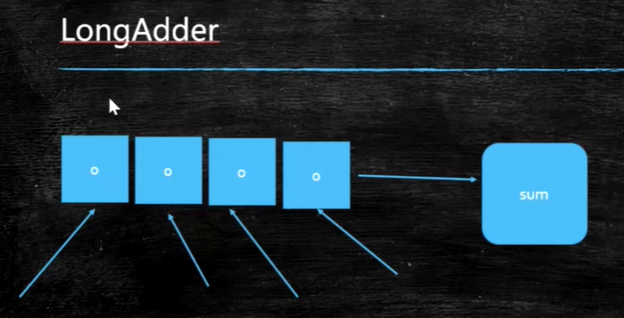
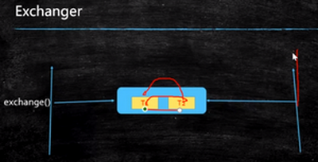

#### AtomicXXX

AtomicLong、synchronized、LongAdder 性能对比：

做递增操作(并发很高)：LongAdder(分段锁)>AtomicLong（CAS）>synchronized(有可能需要申请重量级锁)

LongAdder的分段锁：内部使用数组，将线程的并发分配到数组的每个元素上，线程在每个数组元素上做递增操作，计算完成后将数组的所有元素的值相加得到最终的结果。

场景：商品秒杀

#### ReentrantLock(可重入锁)

new ReentrantLock（true），参数为true表示公平锁

公平锁：首先会检查等待队列中有没有线程，如果有则进入等待队列排队，如果没有则尝试获取锁；并不是绝对的公平，比如第一个线程获取锁后释放锁，然后第二个线程还没有进入等待队列，所以有可能第一个线程再次获取锁；

tryLock:尝试获取锁,当得不到锁的时候可以决定要不要继续wait，而synchronized得不到锁则进入等待队列阻塞

非公平锁：不会检查等待队列中有没有线程，直接竞争锁；

Lock:需要手动解锁，在finally块中解锁

lock.lockInterruptibly：在获取锁之后可以被打断，使用lock.lock获得锁之后不能被打断；

代码：1.两个线程竞争一把锁，2.可重入 3.tryLock 4.lockInterruptibly 5.公平锁非公平锁

#### ReentrantLock VS synchronized

ReentrantLock ：

​	ReentrantLock 可以替代synchronized

​	可以tryLock

​	lockinterupptibly 可以被打断

​	公平锁和非公平锁

#### CoutDownLatch(门栓)

用途：等待多个线程执行结束

#### CyclicBarrier(循环栅栏)

线程同步工具，比如保证n个线程同时执行，类似于汽车满多个人就发车,王者荣耀等人数够了再开始游戏

#### Phaser(按不同的阶段对线程进行执行)

相当于多个栅栏

场景：遗传算法，结婚场景（所有人到达、吃饭、离开、新娘新郎抱抱）

#### Guava RateLimiter

用途：限流，实际中应用，比如网站访问量达到某个值不允许访问

#### ReadWriteLock(读写锁 共享锁、排他锁<互斥锁>)

ReentrantReadWriteLock

读线程采用共享锁，允许其他读线程访问

写线程采用排它锁，写数据的时候不允许其他线程访问

#### Semaphore(信号灯)

fair：设置公平和非公平

公平:比如有4个线程在等待队列，则后来的线程也会进入等待队列排队；非公平：后来的线程有可能会插队，先获取信号量

用途：限流，车道和收费站

比如有100个线程，同时运行的只有两个

#### Exchanger(交换器)

用途：两个线程交换数据

场景：游戏中两个人交换装备

##### 面试：分布式锁

#### 书：实战java高并发程序设计 葛一鸣

#### 锁的分类

乐观类：CAS

悲观锁：synchronized

自旋锁：CAS

读写锁（共享锁、排它锁）

分段锁：LogAdder、concurrentHashMap(jdk1.7)(连老师的公开课)

AQS（公开课）

fork、join：使用场景：分批发短信，然后汇总结果

死锁：jstack可以观察到死锁