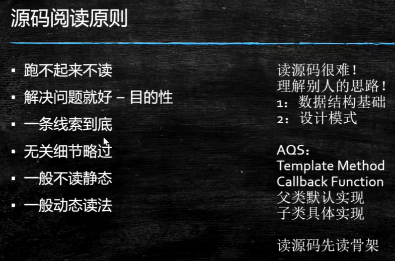
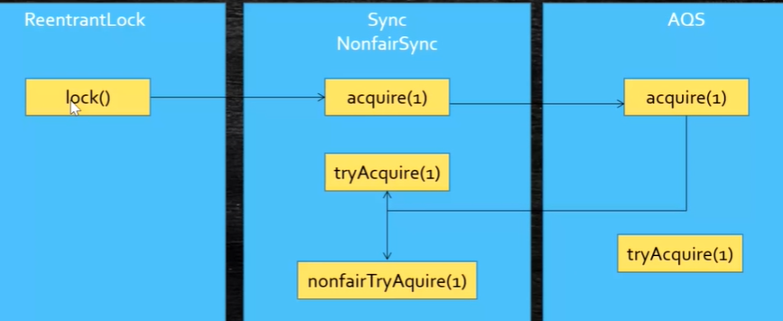
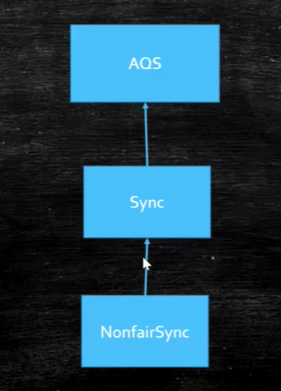
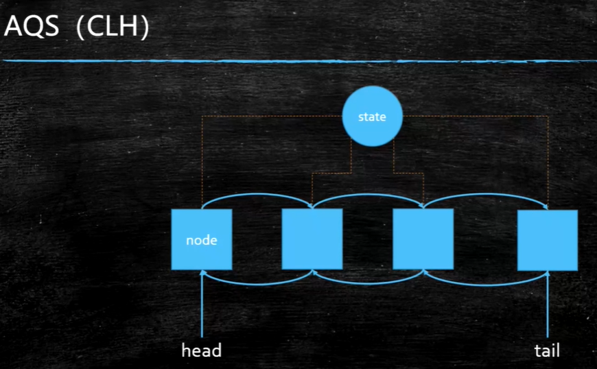

作业：StampedLock

#### LockSupport

park可以让线程阻塞，unpark解除阻塞，unpark可以先于park调用，当先调用unpark然后调用park不会阻塞；

内部使用了Unsafe类

面试题：

```
* 实现一个容器，提供两个方法，add，size
* 写两个线程，线程1添加10个元素到容器中，线程2实现监控元素的个数，当个数到5个时，线程2给出提示并结束
```

1.方法1：使用notify、wait 2.使用两个门栓 3.使用LockSupport

volatile尽量修饰基础类型的变量，如果是对象只能修饰引用

```
写一个固定容量同步容器，拥有put和get方法，以及getCount方法，能够支持2个生成者线程以及10个消费者线程的阻塞调用
```

```
两个线程交替输出A1 ,B2,C3 ...Z26
```

#### 读源码

AQS:底层是CAS+volatile state是volatile修饰的，compareAndSetState是cas操作



画泳道图、UML

ReentrankLock源码：







作业：

1.读AQS源码

2.容器