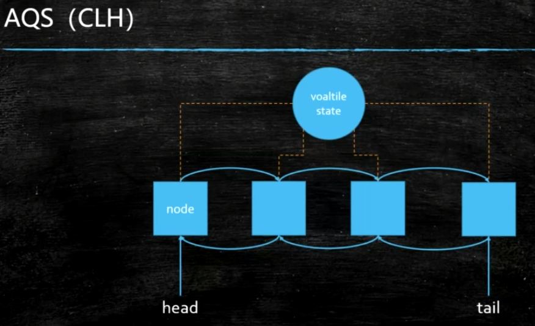
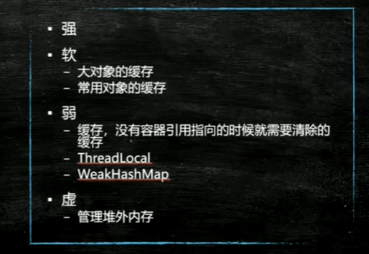
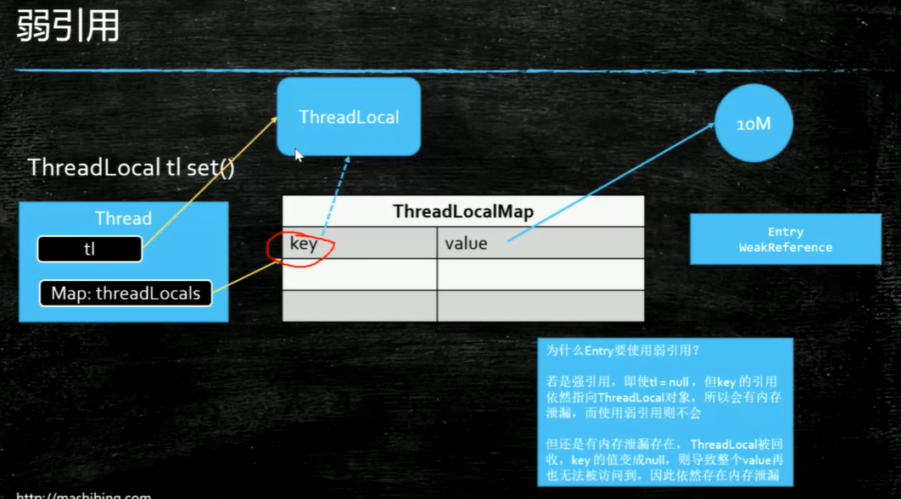
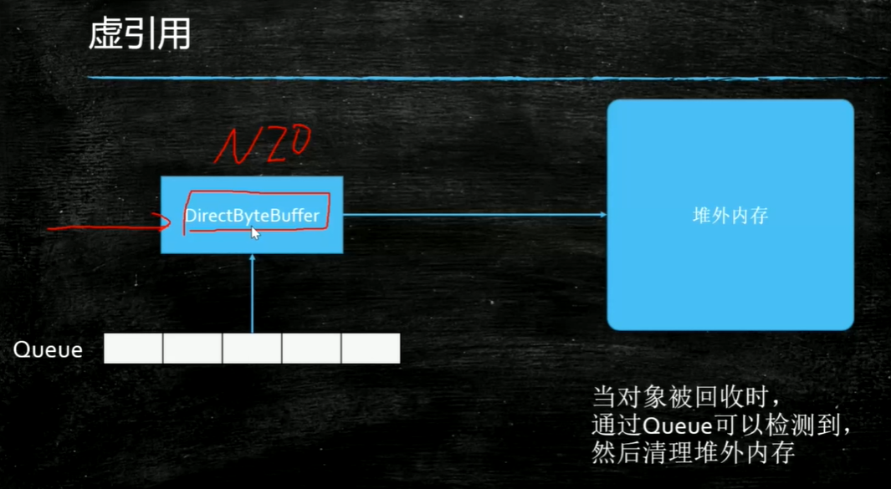

#### AQS源码

VarHandle: 

​	1.普通属性原子操作

​	2.比反射快，直接操纵二进制码

#### 强软弱虚

强引用：new Object();只要有引用指向对象，gc不会回收它

软引用：SoftReference 当head不够用的时候，会把软引用的对象回收,用途是做缓存

弱引用：WeakReference 只要被gc发现就会被回收，用途：ThreadLocal

vm options:-Xms20M -Xmx20M  设置堆内存大小为20M

虚引用：PhantomReference,管理堆外内存

#### ThreadLocal

使用弱引用

-set:Thread.currentThread.map(ThreadLocal,Person)

用途：

​	声明式事务，保证同一个Connection

作业：

1.AQS的unlock

2.软引用的WeakHashMap

预习：

容器--Vector--Hashtable

CopyOnWriteList

ConcurrentHashMap

ConcurrentSkipListMap

BlockingQueue

ThreadLocal

....

Jvm用法