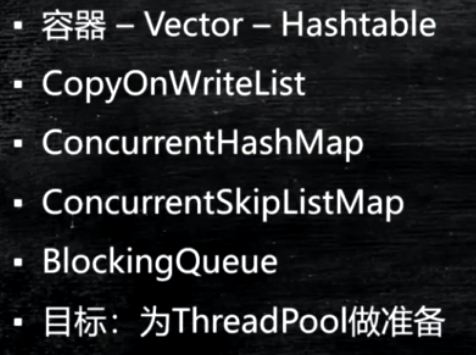
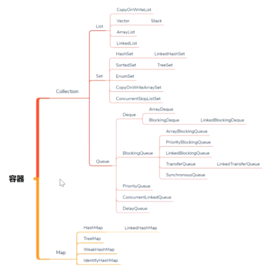
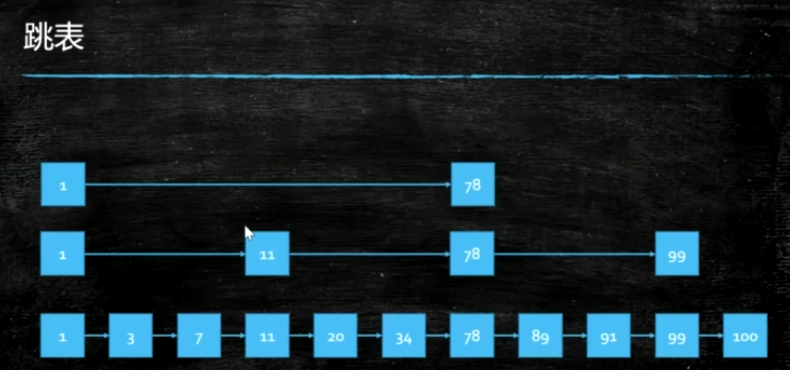
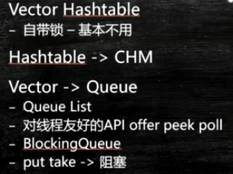

queue:take可以阻塞获取数据

list和queue的区别：queue实现高并发的一些方法

Deque:从尾部装数据，从头上取数据

ProriyQueue:优先级队列

**Vector和HashTable自带锁**

#### HashTable

#### HashMap

代码：100个线程往map中插入1000000个键值对：HashTable、HashMap、ConcurrentHashMap

插入数据的效率：ConcurrentHashMap<HashMap和HashTable

代码：100个线程，从map中取1千万次的指定的数据

读取数据：ConcurrentHashMap远远超过HashTable、HashMap

Collections.synchronizedMap(new HashMap());

#### Vector和ArrayList

多线程：优先使用queue,少用list和set

#### ConcurrentLinkedQueue

取不到值的时候返回null

#### ConcurrentSkipListMap

有序并且支持并发操作

跳跃表

链表查找的时间复杂度是O(N),红黑树查找的时间复杂度是O(logN)

在链表的基础上，抽取一些关键的元素，从下往上链表越来越小，查找的时候从上往下查找

#### CopyOnWriteList

CopyOnWriteArrayList：适用于读多写少的场景

写时复制:当需要往里面加元素的时候，复制一份修改

读的时候不加锁，写的时候拷贝一份数组，把新的元素放进去，然后让数组指针指向新的数组

add：使用lock加锁

#### ConcurrentLinkedQueue

offer:如果队列满了，无法添加返回false，添加成功返回true，peek取数据不会remove，poll取出并移除数据

往队列里面加数据，可以阻塞一段时间

#### LinkedBlockingQueue

阻塞队列，让线程实现自动阻塞，底层使用LockSupport.park实现阻塞

链表实现的无界队列，因为链表没有长度限制

put:如果满了线程阻塞住

take:如果队列空了会阻塞住

#### DelayQueue

使用PriorityQueue来实现

按照等待的时间进行排序，用途：按时间进行任务调度

#### PriorityQueue

优先级队列

Queue：使用poll 的时候size会变

####　SynchronusQueue

容量为0，相当于Exchanger，两个线程交换数据

put:如果没有消费者消费，则put方法会阻塞住

add：会提示队列满了

#### TransferQueue

给线程传递任务

transfer:方法会阻塞，直到有线程把数据取走

#### queue和List的区别

queue添加了很多对线程友好的api，比如offer,peek,poll

BlockingQueue:put take->阻塞

