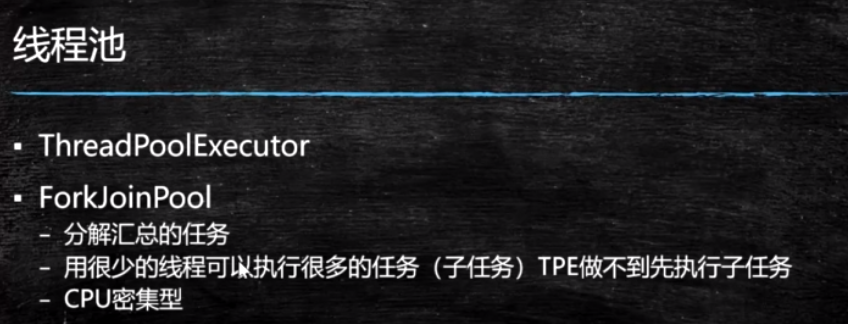
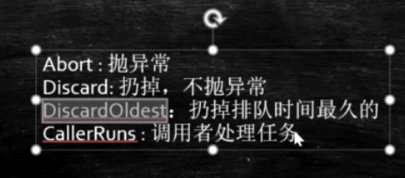

#### 面试：两个线程交替输出A1B2C3...

写法1：wait,notify

写法2：LockSupport

写法3：Lock

写法4：自旋

写法5：BlockingQueue

写法6：PipedStream

写法7：Semaphore

写法8：TransferQueue

#### Executor

定义和运行分开

Callcable:类似Runnable,有返回值

Future:存储未来线程执行的结果

FutrueTask既可以执行线程，又充当了Future的功能：Futrue+Runnable

https://blog.csdn.net/qq_39654841/article/details/90631795

CompletableFuture:将一个任务分成多个子任务，异步去执行每个任务并获取结果

案例：获取多个电商网站的产品价格

#### 线程池

ThreadPoolExcutor

ForkJoinPool

ThreadPoolExcutor参数：

1.核心线程数：线程池启动默认的线程数

2.最大线程数：线程池能够创建线程的上限

3.线程存活时间：当线程超过存活时间后，被释放掉

4.时间单位

5.任务队列：

ArrayBlockingQueue 固定大小的队列

6.线程工厂：

7.线程的拒绝策略：线程池忙并且任务队列满了执行拒绝策略

